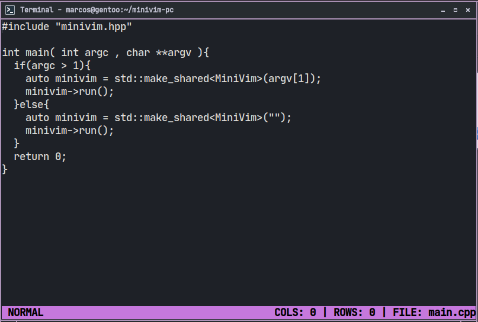
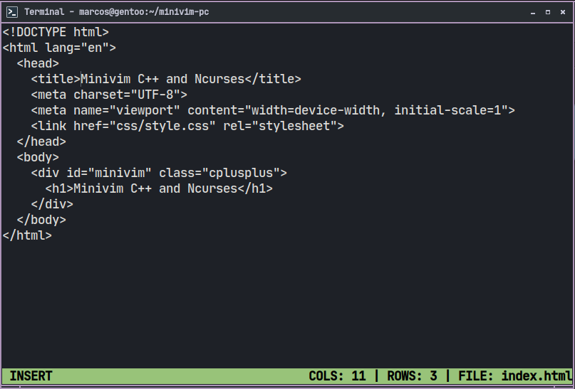

# MiniVim
> Basic example of a mini Vim with C++ and Ncurses.

This mini editor was created in the video: <https://youtu.be/p7k2tiGbcwE>

---

 

 

---

# Dependencies
+ [GNU GCC/G++](https://gcc.gnu.org/)
+ [GNU Make](https://www.gnu.org/software/make/)
+ [Ncurses](https://invisible-island.net/ncurses/)

---

# Building and Running
```bash
git clone https://github.com/terroo/minivim
cd minivim
make
./minivim [filename]
# Examples:
./minivim main.cpp
./minivim index.js
./minivim script.py
```

---

# Using
+ `i` - Insert Mode
+ `Esc` - Normal Mode
+ `Esc w` - Save and Exit

---

Submit your Pull Request!
